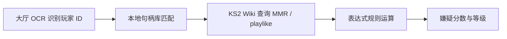

# AntiSmurf

凯瑞甘生存2（Kerrigan Survival 2）地图房主防炸鱼工具。

[](https://github.com/STCrazyCat/KerriganSurvival2Antismurf/actions/workflows/ci.yml)
[](LICENSE)

**下载（最终用户）**：在 GitHub [Releases](https://github.com/STCrazyCat/KerriganSurvival2Antismurf/releases) 页面下载 `AntiSmurf-Setup-x.y.z.exe` 安装包（推荐）或便携版 `AntiSmurf.exe`。

**开源**：源代码托管于 GitHub。参与贡献请参阅 [CONTRIBUTING.md](CONTRIBUTING.md)；维护者发布流程见 [docs/RELEASING.md](docs/RELEASING.md)。

> 将 `STCrazyCat/KerriganSurvival2Antismurf` 替换为你的 GitHub 用户名或组织名后即可推送仓库。

## 功能

- **内存模式 6 大厅识别**：直接读取 SC2 内存中的房间成员结构（句柄 / 昵称 / 战队 / 阵营 MMR / playlike），无需 OCR
- **句柄位置自适应**：游戏版本更新导致固定跳转失效时，自动/手动在主机句柄附近嗅探多格式存储，结合附近结构信息（profile_id / struct 头 / 显示名）确认新位置并自动持久化
- 进入 KS2 房间后自动评分，极高嫌疑可自动踢人；默认 Dry Run 不实际踢人
- **评分规则系统**：可视化表达式编辑器 + AI 助手（填 API Key 自然语言生成规则）+ 本地 IDE 编辑 + 规则包导入导出
- **同局窥屏者检测**：与主机同一对局（分钟级）且凯瑞甘阵营 MMR 异常升高时 +20 分/次，并弹窗通知（对象 / 次数 / 原因）
- **白名单模式**：一键切换为仅保留白名单玩家（自动踢出其余玩家）；支持批量白名单输入（自动识别分隔符并补全句柄前缀）
- **分数着色**：正分红 / 负分绿 / 零分白，可在设置中自定义
- 一键拉黑 +200 嫌疑分；结合 KS2 Wiki / 社区 MMR / playlike 进行嫌疑评估
- 自动索引本地 KS2 录像识别句柄并加载战绩用于二次评估
- 高嫌疑玩家支持手动查看档案、踢出、加白名单、降级

## 分发方式

AntiSmurf 以 **GitHub Releases 安装包** 为主要分发渠道，源代码同步开源。

| 方式 | 产物 | 适用场景 |
|------|------|----------|
| **GitHub Release 安装包（推荐）** | `AntiSmurf-Setup-x.y.z.exe` | 正式分发给房主用户 |
| **GitHub Release 便携版** | `AntiSmurf.exe` | 免安装试用 |
| **源码运行** | `git clone` + `pip install -r requirements.txt` | 开发者与贡献者 |

维护者构建安装包：见 [docs/RELEASING.md](docs/RELEASING.md)。

### 历史说明（本地构建）

AntiSmurf 也支持在维护者本机打包：

安装包由 [Inno Setup 6](https://jrsoftware.org/isdl.php) 生成，安装到 `Program Files\AntiSmurf`，并创建开始菜单快捷方式；卸载时保留 `config/user.toml` 与 `data/` 中的用户数据。

## 安装（最终用户）

1. 下载并运行 `AntiSmurf-Setup-x.y.z.exe`
2. 按向导完成安装
3. 从开始菜单启动 **AntiSmurf**
4. 在 KS2 大厅中使用 **「UI 校准」** 完成首次配置

## 开发环境安装

**Python 版本**：请使用 **3.11 / 3.12 / 3.13（64 位）**。PaddlePaddle 目前**不支持 Python 3.14**，在 3.14 上会出现 `No matching distribution found for paddlepaddle`。

```powershell
cd c:\AntiSmurf
# 推荐：用 3.12 创建虚拟环境
py -3.12 -m venv .venv
.venv\Scripts\activate

# 核心依赖
pip install -r requirements.txt

# OCR 依赖（PaddlePaddle 需从官方源安装，勿直接 pip install paddlepaddle）
.\scripts\install_vision_deps.ps1

# 或一步安装（核心 + OCR）
.\scripts\install_deps.ps1
```

若只需录像扫描、规则编辑等**非 OCR 功能**，可跳过 vision 安装；大厅视觉识别需完成 `install_vision_deps.ps1`。

**推荐显示模式**：星际争霸2 使用 **窗口化 + 最大化**（非独占全屏）。程序会截取 SC2 **客户区**进行 OCR，与窗口边框无关。

首次运行 OCR 会下载 PaddleOCR 模型（约数百 MB）。分辨率稳定后校准一次即可。

诊断 OCR 区域：

```bash
python scripts/diagnose_vision.py
```

## 运行

```bash
python main.py
```

无界面模式：

```bash
python main.py --headless
```

## 配置

- 默认配置：`config/default.toml`
- 用户覆盖：`config/user.toml`（自行创建）
- 社区测试数据：`config/community_stub.json`

### 社区 Stub 示例

```json
{
  "5-S2-1-1234567": { "mmr": 5200, "mmr_playlike": 2800 }
}
```

### UI 校准

主界面点击 **「UI 校准」**：

- 配置本机句柄（`[host].handle`，用于录像绑定与踢人排除）
- **捕获地图名区域** — OCR 检测是否进入 KS2 房间
- **捕获玩家 ID 区域**（每槽一位）— OCR 识别 `<#战队>#玩家ID`
- **捕获踢人坐标**（每槽一位）— 右键踢人菜单点击位置

### KS2 房间检测（OCR + 手动确认）

程序对 SC2 窗口截图并用 PaddleOCR 识别地图名与槽位玩家 ID。也可在 OCR 不稳定时 **手动确认房间**：

| 操作 | 说明 |
|------|------|
| **确认 KS2 房间** | 手动声明当前在大厅；OCR 不会自动退出房间状态 |
| **离开房间** | 结束大厅监控并清空玩家列表 |
| **暂停识别** | 游戏开始后关闭 OCR 周期扫描，避免占用快捷键或干扰操作 |
| **恢复识别** | 重新启用 OCR（大厅阶段） |

| 状态 | 行为 |
|------|------|
| **进入 KS2 房间**（OCR 或手动） | 开始识别玩家、评估嫌疑、可自动踢人 |
| **离开 KS2 房间** | 暂停监控、清空玩家列表 |

```toml
[vision]
enabled = true
engine = "paddleocr"
scan_interval_sec = 3.0
save_debug_images = false   # 调试时保存裁剪图到 logs/vision/
```

### 本地录像索引（句柄 ↔ 玩家名数据库）

启动后自动扫描最近 **100 场** KS2 本地录像，从录像元数据提取 **句柄**（`toon_handle`，如 `5-S2-1-6738824`）与 **玩家名** 的一一对应关系，写入 SQLite：`data/replay_bindings.db`。评估入房玩家时会用该库补全 OCR 仅识别到 profile ID 的情况，并附加录像战绩（胜率/连胜规则）。

**默认扫描路径**（点击「扫描录像」时全量扫描）：

1. `config/user.toml` 中 `[replays].paths` 指定目录（仅扫该目录 + 本机句柄目录）  
2. 若 `paths` 留空，则自动发现所有账号下的 `Documents\StarCraft II\Accounts\...\Replays\`  

主界面或 **「数据源」** 对话框中的 **「扫描录像」** 会在后台显示进度条，建立 `data/replay_bindings.db` 句柄唯一库（**不会**在「确认并启用」时阻塞界面）。

```toml
[host]
handle = "5-S2-1-12208616"   # 用于定位你的 Multiplayer 录像文件夹

[replays]
enabled = true
max_count = 100
refresh_sec = 60
paths = []          # 留空则自动发现；可填自定义录像目录
ks2_only = true     # 仅索引 KS2 地图录像
filename_priorities = ["凯瑞甘生存2 最新版"]  # 文件名优先扫描（其次按修改时间）
```

扫描时优先处理文件名包含上述关键词的录像，再处理其余录像；默认最多索引 **100** 场 KS2 录像（`max_count`）。

**手动扫描与诊断**：

```bash
# 扫描单个录像（项目内样例）
python scripts/diagnose_replays.py --file "凯瑞甘生存2 最新版 (1044).SC2Replay"

# 扫描默认/句柄对应目录，写入 data/replay_bindings.db
python scripts/diagnose_replays.py --handle 5-S2-1-12208616 --limit 50

# 指定目录
python scripts/diagnose_replays.py --path "C:\Users\user\Documents\StarCraft II\Accounts\...\Replays\Multiplayer"
```

校准向导中可点击 **「刷新录像索引」** 手动重建索引。

### 社区 HTTP 对接

```toml
[community]
provider = "http"
base_url = "https://your-community-server.com"
api_key = "your-token"
```

### 黑名单

- 玩家行点击 **「黑名单」** 加入并重新评估
- 或编辑 `config/blocklist.txt`（每行一个句柄）

### 白名单模式

- 主界面按钮栏勾选 **「白名单模式」**：自动踢出白名单以外的所有玩家（仅白名单玩家可留在房间，适合私房/车队）
- 白名单来源 = 数据库白名单（玩家行 **「白名单」**）或 **handle_trust_rules**（白名单 -20 规则）
- 默认 **黑名单模式**（不勾选）：按嫌疑分阈值自动踢出，白名单玩家安全
- 切换即时生效，配置保存至 `config/user.toml`（`whitelist_mode`）

### 设置面板

主界面 **「设置」** 可配置：嫌疑阈值、社区 HTTP（KS2 Wiki）、Windows 通知等，保存至 `config/user.toml`。

### 数据源确认（录像 / 规则 / 名册 / 在线文档）

主界面 **「数据源」** 可一次性确认并启用：

| 项目 | 说明 |
|------|------|
| **录像扫描目录** | 本地 SC2 录像文件夹（确认后启用索引） |
| **规则包 (.txt/.toml)** | 可分享的评分规则包；确认时自动加载到引擎 |
| **名册表格 (.xlsx/.csv)** | 句柄 / 玩家 ID / 备注 数据库 |
| **拉取 URL** | HTTP GET 拉取在线表格导出（CSV/XLSX） |
| **上传 URL** | HTTP POST JSON `{ "version": 1, "rows": [...] }` 写回合并结果 |

点击 **「测试」** 校验路径与 URL，再 **「确认并启用」** 后才会自动同步名册；录像需单独点 **「扫描录像」**（带进度条）。配置写入 `config/user.toml` 的 `[data_sources]`、`[replays]`、`[roster.sync]` 段。

```toml
[data_sources]
rules_pack_path = "D:/rules/my_pack.txt"
confirmed = true

[replays]
paths = ["C:/Users/你/Documents/StarCraft II/.../Replays/Multiplayer"]

[roster.sync]
provider = "local_file"
path = "config/player_roster.xlsx"
fetch_url = "https://example.com/roster.xlsx"   # 可选：拉取在线文档
push_url = "https://example.com/api/roster"     # 可选：上传合并结果
api_key = ""
```

在线文档需自备 **Webhook/API**（接收 POST JSON）；腾讯文档直连 API 仍为预留项（`tencent_docs`）。

### 玩家名册（云表格同步）

在腾讯文档等在线表格中维护三列：**玩家名**、**句柄**、**备注**，导出为 Excel/CSV 后由 AntiSmurf 同步到本地名册。

**Phase 1（当前）**：本机文件同步

1. 复制模板 `config/templates/player_roster_template.xlsx` 或自建表格（表头支持中英文：`玩家名`/`display_name`、`句柄`/`handle`、`备注`/`remark`）
2. 在腾讯文档中编辑后，**导出为 Excel** 保存到 `config/player_roster.xlsx`
3. 在 `config/user.toml` 启用同步：

```toml
[roster]
enabled = true
sync_interval_sec = 300

[roster.sync]
provider = "local_file"
path = "config/player_roster.xlsx"
```

4. 主界面 **「玩家名册」** 可查看、手动导入、立即同步；大厅玩家行会显示备注（句柄后括号内）

**双向同步（上传）**：启用 `push_enabled = true` 后，每次同步会：

1. 读取在线表格/本地 xlsx 当前内容
2. 以 **句柄唯一** 合并本地数据（名册库 + 录像绑定）
3. **新增句柄** 自动追加到表格
4. **玩家名变更** 时更新表格中的玩家名，并在备注追加 `曾用名: <旧名>`

```toml
[roster.sync]
push_enabled = true
push_from_replays = true
former_name_prefix = "曾用名"
```

将腾讯文档导出文件保存为 `config/player_roster.xlsx` 后，同步会写回该文件；你可将更新后的文件重新上传/覆盖到腾讯文档，或等待 Phase 2 在线 API。

命令行：

```bash
python scripts/sync_roster.py --import config/player_roster.csv
python scripts/sync_roster.py --init-template
```

**Phase 2**：`provider = "http_url"` 或 `local_file` + `fetch_url`/`push_url`（见上方「数据源」对话框）

名册用于补充 OCR/录像无法确定的句柄映射，不替代录像自动绑定。

### 嫌疑评估流程



1. **OCR** 识别房间内 `<#战队>#玩家ID` 或纯数字 ID  
2. **句柄解析**：在录像绑定库 / 名册中按 profile ID 查找句柄；若多个候选则标记 `handle.ambiguous=1`；若 ID 含 `1/l/I` 混淆则标记 `ocr.digit_obfuscation=1`  
3. **[KS2 Wiki](https://wiki.ks2.top/)** 按句柄拉取 MMR、核心 playlike、职业数据  
4. **规则引擎** 对变量做比较运算，累加权重得到 0–100 嫌疑分  

主界面 **「评分规则」** 提供分类变量菜单与运算符选择，可视化拼装运算式与嫌疑权重。

### 用 AI 助手编写规则

规则编辑器顶部 **「AI 助手」** 可用自然语言生成规则：填写 API Key（OpenAI 兼容接口，默认 DeepSeek）→ 输入需求 → 生成 → 预览确认后追加。

#### 常用变量

| 变量 | 说明 |
|------|------|
| `mmr.survivor` / `mmr.kerrigan` | 生存者 / 凯瑞甘核心 MMR |
| `mmr.min` / `mmr.max` | 核心 MMR 最小 / 最大值 |
| `mmr_playlike.max` | 反推核心 MMRplaylike 最大值 |
| `playlike.avg_all` | 全局 playlike 均值（未扣 class） |
| `role.mmr.角色名` | 角色官方 MMR |
| `lift.core_max` | playlike 高于核心最大幅度 |
| `spike.count` / `spike.max` | 异常对局数 / 最大幅度 |
| `data.has_mmr` / `data.has_playlike` | 数据存在性 |
| `blocklist.hit` | 黑名单标记 |
| `history.win_rate` 等 | 手动战绩 |

完整变量表见 **「评分规则」→ 编辑器 → 变量菜单**。

#### 运算符

`>=` `<=` `>` `<` `==` `!=`（比较）、`between`（介于）、`is_null` / `not_null`（为空 / 非空）；可对变量做 `+ - * /` 算术后再比较。

#### 提示词示例

```
凯瑞甘核心 MMR 高于 3000 且 playlike 对局数 >= 5 时，加 30 嫌疑分
```

AI 返回 JSON 规则数组，程序自动校验后追加（不覆盖已有规则）。

#### API Key 配置

| 服务 | API 地址 | 模型 |
|------|---------|------|
| DeepSeek（默认） | `https://api.deepseek.com/v1` | `deepseek-chat` |
| Kimi (Moonshot) | `https://api.moonshot.cn/v1` | `moonshot-v1-8k` |
| OpenAI | `https://api.openai.com/v1` | `gpt-4o-mini` |
| OpenRouter | `https://openrouter.ai/api/v1` | `openrouter/auto` |

也可在 **「AI 助手」** 对话框内直接填写 / 修改，保存至 `config/user.toml`（`[ai]` 段）。

### 用本地 IDE 编写规则

规则编辑器顶部 **「IDE 编辑」** 将当前规则导出到 `config/rule_edit.toml` 并用 VSCode 打开（未安装 VSCode 时回退系统默认编辑器）；修改保存后点 **「从文件重载」** 应用。

### 评分规则分享（.txt / .toml）

自定义踢人/评分规则以 **TOML 格式** 分享，扩展名可用 `.txt` 或 `.toml`，与内置预设完全兼容。

示例规则包：

```toml
# AntiSmurf Rule Pack v1

[pack]
version = 1
name = "我的规则"

[[expression_rules]]
id = "handle_discriminator_high"
enabled = true
label = "玩家 ID 过高（疑似新号）"
left = "handle.profile_id"
op = ">="
right = 15000
weight = 25
else_weight = 0
```

- GUI：**评分规则** → **导入规则** / **导出规则**（支持合并或替换）
- 命令行：`python scripts/import_rules.py --file rules.txt --mode merge`

规则变量与运算符见 `src/antismurf/scoring/expression_engine.py` 中的 `VARIABLE_CATALOG` 与 `OPERATORS`。

### 踢人菜单偏移

右键踢人后，若菜单项不在第一项，在 `user.toml` 设置：

```toml
[actions]
kick_menu_down_presses = 1
```

### 手动校准示例（user.toml）

```toml
[host]
handle = "5-S2-1-12208616"

[calibration.map_region]
x = 0.35
y = 0.02
w = 0.30
h = 0.05

[[calibration.slot_id_regions]]
x = 0.12
y = 0.30
w = 0.18
h = 0.035

[[calibration.slot_regions]]
x = 0.15
y = 0.35
```

## 打包与发布

### 一键构建安装包（推荐）

1. 安装 [Inno Setup 6](https://jrsoftware.org/isdl.php)
2. 在项目根目录执行：

```powershell
# 构建便携版 + 安装包（自动踢人启用）
.\scripts\build_installer.ps1 -EnableAutoKick
```

分支说明见 [docs/BRANCHES.md](docs/BRANCHES.md)。

输出：
- `dist/AntiSmurf.exe` — 便携版主程序
- `dist/AntiSmurf-Setup-x.y.z.exe` — 安装包
- `dist/AntiSmurf-x.y.z-portable.zip` — 便携压缩包

若未安装 Inno Setup，脚本仍会生成便携版 exe，并提示如何单独编译安装包。

### 仅构建便携版 exe

```powershell
python -m PyInstaller build.spec
```

输出：`dist/AntiSmurf.exe`

### 安装后目录结构

```
C:\Program Files\AntiSmurf\
├── AntiSmurf.exe
├── 使用说明.txt
├── config\
│   ├── community_stub.json
│   ├── user.toml          ← 用户配置（首次运行或校准时生成）
│   └── blocklist.txt
├── data\                  ← SQLite 数据库
└── logs\                  ← 踢人失败截图等
```

首次运行 exe 时，可在 `config/` 下创建 `user.toml`（可通过 GUI「UI 校准」自动生成）。`config/community_stub.json` 可放在安装目录覆盖内置测试数据。

## 注意事项

1. 大厅 UI 不显示他人游戏历史，战绩需在游戏内档案或后续 API 功能中查看
2. OCR 识别玩家 ID 后，句柄默认按本机 `host.handle` 的区服构造（如 `5-S2-1-{ID}`），录像库有绑定时优先使用绑定句柄
3. UI 自动化可能受分辨率与语言影响，建议完成 UI 校准；踢人槽位顺序需与 ID 识别槽位一致
4. 首次 PaddleOCR 加载较慢，属正常现象
